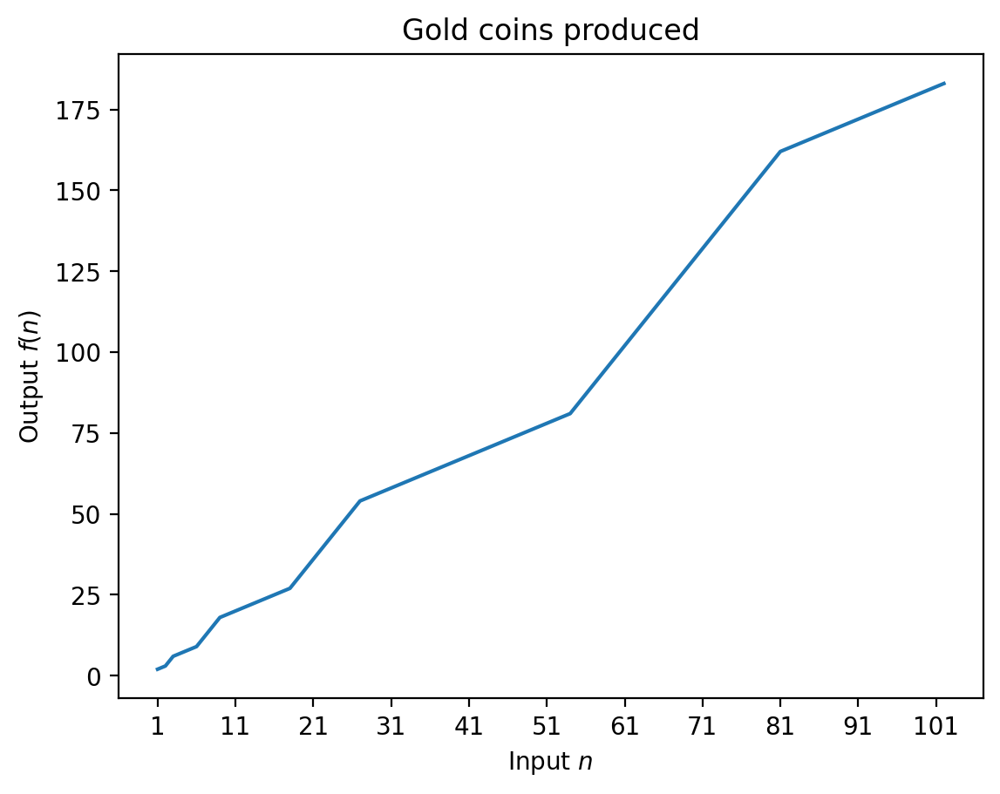

# Solution

My immediate first approach was to come up with a closed formula for the number of coins produced by the bag. If $f$ is the function of gold coins produced by the bag and $n$ is the number of coins put into it, then we want to find $f(n)$ when $n$ is 13.

We know that $f(f(n))=3n$, but since we're constrained by the fact that the bag must always produce a whole number of coins for a given integer input, the naive solution $f(n)=\sqrt{n}$ doesn't work. I tried a few different functions, such as $f(n)=an-b$ or $f(n)=an(n-b)$ (_"Maybe removing and re-adding something will cancel it out?"_), and attempted to solve for $f(f(n))=3n$ but that resulted in a dead end.

After taking a step back, I tried reducing the problem down to its base form: "If I put in 1 coin, can I find out how many coins will come out?" This ended up seeming like a promising path forward, since I know that the answer must be 2, since it must be greater than 1 by rule [(2)](../README.md#problem) and less than 3 by rule [(3)](../README.md#problem). So we can start to fill out the table below: the first line allows us to fill in the second line ($f(2)=3$), which in turn allows up to fill in the third (if $f(n) = 3$ then $f(f(n))=6$). Similarly, we can fill in the 6th and 9th lines.

| Input $n$ | $f(n)$ | $f(f(n))$ |
| --------- | ------ | --------- |
| 1         | 2      | 3         |
| 2         | 3      | 6         |
| 3         | 6      | 9         |
| 4         |        | 12        |
| 5         |        | 15        |
| 6         | 9      | 18        |
| 7         |        | 21        |
| 8         |        | 24        |
| 9         | 18     | 27        |
| 10        |        | 30        |
| 11        |        | 33        |
| 12        |        | 36        |
| 13        |        | 39        |

We now know that that $f(4)$ must be between either 7 or 8 (it needs to be greater than 6 and less than 9 by rule (3)). On the other hand, $f(5)$ needs to be greater than $f(4)$ and less than 9, which only leaves 8 as a valid option. This forces $f(4)=7$. We can then fill in lines 7 and 8 as well, followed by line 12. Finally, using the same logic as for 4 and 5, we can fill in 10 and 11, which must be 19 and 20, respectively.

| Input $n$ | $f(n)$ | $f(f(n))$ |
| --------- | ------ | --------- |
| 1         | 2      | 3         |
| 2         | 3      | 6         |
| 3         | 6      | 9         |
| 4         | 7      | 12        |
| 5         | 8      | 15        |
| 6         | 9      | 18        |
| 7         | 12     | 21        |
| 8         | 15     | 24        |
| 9         | 18     | 27        |
| 10        | 19     | 30        |
| 11        | 20     | 33        |
| 12        | 21     | 36        |
| 13        |        | 39        |

To solve 13, we'll need to extend the table further to 15, since we need to set an upper bound for 13 and we know that $f(15)=24$ from line 8.

| Input $n$ | $f(n)$ | $f(f(n))$ |
| --------- | ------ | --------- |
| ...       | ...    | ...       |
| 8         | 15     | 24        |
| 9         | 18     | 27        |
| 10        | 19     | 30        |
| 11        | 20     | 33        |
| 12        | 21     | 36        |
| 13        |        | 39        |
| 14        |        | 42        |
| 15        | 24     | 45        |

Finally, as before, we know that $f(13)$ must be either 22 or 23 which forces $f(14)$ to be 23 and so $f(13)=22$.

| Input $n$ | $f(n)$ | $f(f(n))$ |
| --------- | ------ | --------- |
| ...       | ...    | ...       |
| 12        | 21     | 36        |
| 13        | 22     | 39        |
| 14        | 23     | 42        |
| 15        | 24     | 45        |

**Final answer:** The bag will produce 22 coins when you place in 13.

## Alternative solution

You can find TED-Ed's solution to the problem on YouTube starting at [2:00](https://youtu.be/qgvmJTmJIKs?t=120). Their solution is the same as mine, but with prettier drawings.

## Solution to bonus problem

I ran through a couple more examples to see if a pattern emerged or if a closed formula was even possible. Could there be some larger number for which we can't resolve to a unique number?

Looking at the ratio between $f(n)$ and $n$, we note that it is always between 1.5 and 2. Furthermore, the ratio starts off at 2 (for $n=1$), decreases monotonically to 1.5, then back up to 2, then back down to 1.5, and so on (see [table.csv](table.csv)). We can plot the first 102 points in the graph below using the following Python code:

```python
%matplotlib inline
import matplotlib.pyplot as plt
%config InlineBackend.figure_format="retina"

data = [
    2,3,6,7,8,9,12,15,18,19,20,21,22,23,24,25,26,27,30,33,36,39,42,45,48,51,54,
    55,56,57,58,59,60,61,62,63,64,65,66,67,68,69,70,71,72,73,74,75,76,77,78,79,
    80,81,84,87,90,93,96,99,102,105,108,111,114,117,120,123,126,129,132,135,
    138,141,144,147,150,153,156,159,162,163,164,165,166,167,168,169,170,171,
    172,173,174,175,176,177,178,179,180,181,182,183,
]
x_range = range(1, len(data) + 1)

plt.plot(x_range,data)
plt.xticks(x_range[::10])
plt.title("Gold coins produced")
plt.xlabel("Input $n$")
plt.ylabel("Output $f(n)$")
plt.show()
```



An even clearer pattern emerges when looking at successive differences (see [table.csv](table.csv) again): the differences are always either 1 or 3, as the above graph implies. Furthermore, the differences are 1 when the ratio of $f(n)$ to $n$ is decreasing from 2 to 1.5 and 3 when the ratio is increasing to 2.

Finally, we note that the values of $n$ for which the ratio is the greatest (i.e. 2) are the powers of 3, and the ratio is the smallest (i.e. 1.5) when $n$ is two times a power of 3.

Putting all of this together, we can obtain a closed formula for $f$, the number of coins produced by the bag.

**Final answer:**

Given an input number of coins $n$, $f(n)$ is given by the following piecewise function.

$$
f(n) =
    \begin{cases}
        2n & \text{if }n\text{ is a power of 3}\\
        \frac{3n}{2} & \text{if }n\text{ is 2 times a power of 3}\\
        2\times3^m + (n - 3^m) & \text{if }\exists m\in\mathbb{N}: 3^m< n< 2\times 3^m \\
        3^{m+1} + 3\times(n-2\times3^m) & \text{if }\exists m\in\mathbb{N}: 2\times 3^m< n< 3^{m+1} \\
    \end{cases}
$$

We can also convert this to a Python function for fun (and readability?):

```python
import math


def is_power(number: int, base: int) -> bool:
    if number == 1:
        return True
    while number % base == 0:
        number //= base
    return number == 1


def coins_produced(n: int) -> int:
    if is_power(n, 3):
        return 2 * n
    if is_power(n / 2, 3):
        return int(3 * n / 2)

    m = math.floor(math.log(n, 3))
    if 2 * 3**m < n:
        return 3 * n - 3 ** (m + 1)
    return 3**m + n
```
